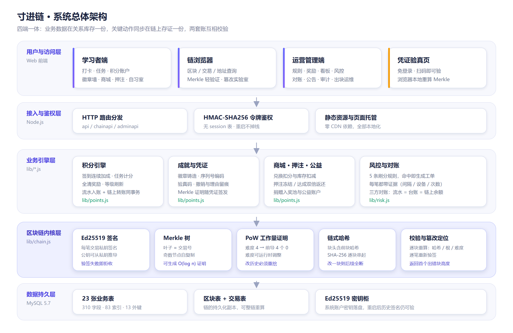
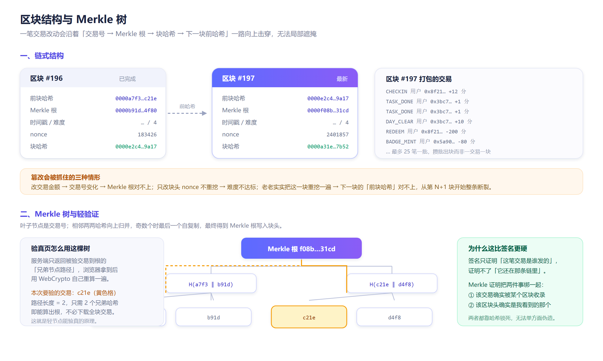
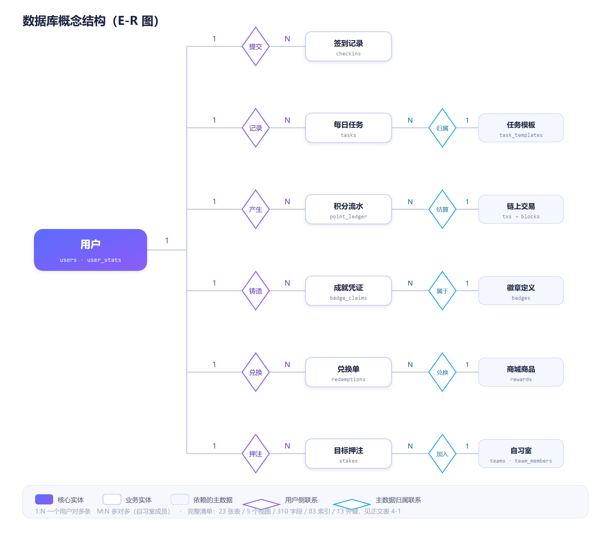
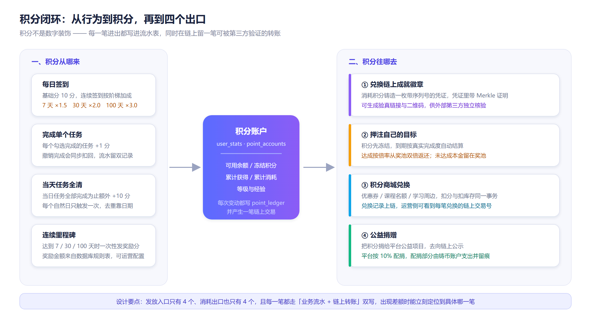
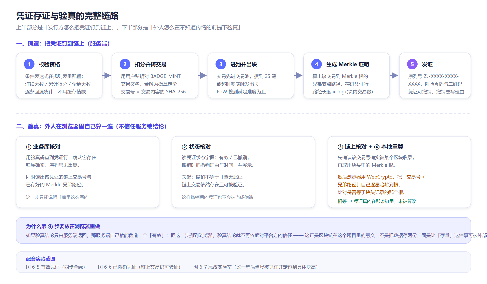

# 摘要

习惯养成类应用普遍采用"打卡—积分—奖励"的激励闭环，但这类系统的核心资产恰恰最容易被平台方单方面修改：积分余额、徽章记录、兑换流水全部存在运营方的数据库里，用户既无法确认自己看到的数字没有被后台改动，也无法向第三方证明某项成就真实存在。本文设计并实现了一个把激励数据同时写入区块链的打卡积分平台——**寸进链**（CunjinChain），尝试用"业务库 + 链上存证"的双账结构解决上述信任问题。

系统采用前后端分离架构。后端基于 Node.js 实现，包含约 2 400 行服务端代码与 8 个功能模块；数据库采用 MySQL 5.7，设计 23 张业务表、5 个视图、310 个字段、83 个索引和 13 个外键约束。区块链部分不依赖任何第三方链平台，完全自研实现：使用 SHA-256 构造链式哈希与 Merkle 树，采用 Ed25519 对每一笔交易签名，以工作量证明（Proof of Work）作为出块条件，并通过交易池批量打包降低出块频率。系统划分为学习者端、链浏览器、运营管理端和凭证验真页四个端，前端为原生 ES 模块，图表与图标全部手写 SVG，不引入任何 CDN 依赖。

本文的主要工作有四点。第一，把积分发放与消耗全部建模为链上交易，签到、任务完成、当日全清、徽章铸造、商城兑换、目标押注、公益捐赠七类动作在落库的同时产生带签名的交易，使业务流水、账户台账和链上余额三者可交叉对账。第二，设计了可对外验真的成就凭证：凭证携带序列号、验真码与该笔交易在区块内的 Merkle 路径，验真页面在浏览器端用 WebCrypto 独立重算 Merkle 根并比对块头，验真结论不依赖对服务端的信任。第三，实现了面向管理端的风控与对账机制，包含 5 条刷卡规则、三方对账和完整的操作审计。第四，构建了可交互的"篡改实验室"，把区块时间戳、交易金额、交易顺序等六类篡改方式做成可视化实验，篡改后系统能定位到首个出错的区块高度。

测试结果表明：全链 197 个区块、4 890 笔交易的完整性校验（链式哈希、Merkle 根、工作量证明、交易签名）全部通过；三方对账在 60 个用户上无差额；在难度 4 的配置下平均出块耗时约 208 毫秒；包含四个端、移动端适配与端到端链路的 42 项自动化验收全部通过。系统验证了在中低频业务场景下，用轻量自研区块链为激励数据提供可验证性的可行性。

**关键词**：区块链；打卡激励；积分系统；Merkle 树；Ed25519；成就存证

# Abstract

Habit-tracking applications commonly rely on a "check-in, points, reward" incentive loop. The core assets of such systems, however, are exactly the ones most easily altered unilaterally by the platform: point balances, badge records and redemption histories all live in the operator's own database. Users cannot confirm that the numbers they see have not been modified in the backend, nor can they prove to a third party that a claimed achievement ever existed. This paper designs and implements **CunjinChain**, a check-in and points platform that simultaneously records incentive data on a blockchain, using a dual-ledger structure of "business database plus on-chain attestation" to address the trust problem above.

The system follows a front-end/back-end separated architecture. The back end is built on Node.js with roughly 2,400 lines of server-side code across eight modules. MySQL 5.7 stores the relational data, comprising 23 business tables, 5 views, 310 columns, 83 indexes and 13 foreign key constraints. The blockchain component is implemented entirely from scratch without relying on any third-party chain platform: SHA-256 builds the chained hashes and the Merkle tree, Ed25519 signs every transaction, Proof of Work serves as the block-generation condition, and a transaction pool batches transactions to reduce mining frequency. The system is divided into four ends: a learner client, a block explorer, an operations console and a public credential verification page. The front end uses native ES modules, with all charts and icons hand-written in SVG and no CDN dependency.

Four contributions are made. First, point issuance and consumption are modeled as on-chain transactions: check-ins, task completion, day clearance, badge minting, shop redemption, goal staking and charitable donation all produce signed transactions alongside database writes, making the business ledger, the account ledger and the on-chain balance mutually reconcileable. Second, a verifiable achievement credential is designed, carrying a serial number, a verification code and the Merkle path of its transaction within the block; the verification page recomputes the Merkle root locally with WebCrypto and compares it against the block header, so the conclusion does not depend on trusting the server. Third, risk control and reconciliation facilities are provided for the operations console, including five abuse-detection rules, three-way reconciliation and a complete audit trail. Fourth, an interactive "tampering laboratory" is built, turning six tampering methods, such as altering block timestamps, transaction amounts and transaction ordering, into visual experiments; after tampering, the system locates the first corrupted block height.

Test results show that the integrity check over all 197 blocks and 4,890 transactions, covering chained hashes, Merkle roots, Proof of Work and transaction signatures, passed entirely. Three-way reconciliation reports no discrepancy across 60 users. At difficulty 4, the average block time is about 208 milliseconds. All 42 automated end-to-end acceptance checks, spanning four ends, mobile adaptation and the full verification path, pass. The system demonstrates the feasibility of using a lightweight self-implemented blockchain to provide verifiability for incentive data in low-to-medium frequency business scenarios.

**Keywords**: Blockchain; Habit tracking; Points system; Merkle tree; Ed25519; Achievement attestation

# 第一章 绪论

## 1.1 研究背景

"日拱一卒，功不唐捐"。打卡类应用把长期目标拆解成每日可执行的小任务，再用积分和徽章提供即时反馈，这套机制在学习、健身、阅读等场景中被广泛使用。平台通常还会提供排行榜、组队自习室、积分商城等扩展功能，让积分具备一定的兑换价值。

然而，只要积分的获取和消耗记录完全掌握在平台手中，这套激励机制的公正性就建立在"相信平台"的基础上。具体而言存在三类问题：

第一，**数据可被无痕修改**。积分余额通常以单行记录的形式存在数据库中，运营方调整一条 SQL 即可改变任意用户的余额，用户端看到的数字随之变化，但没有任何痕迹说明它曾经是多少。徽章、等级、兑换记录同理。

第二，**成就无法对外证明**。用户如果把徽章截图发给他人，接收方无从判断真伪。平台理论上可以提供一个查询接口，但接口的返回值同样由平台控制，第三方仍然是在信任平台。

第三，**规则调整缺少可追溯性**。积分规则（签到给多少分、全清奖励多少分）属于运营配置，调整后既有的历史数据是否按旧规则计算、调整本身是否经过公示，往往没有留存证据。

区块链技术恰好针对这类"多方参与、需要可信留存、由中心化主体保管数据"的场景。它通过链式哈希保证历史数据不可篡改，通过数字签名确认操作来源，通过共识机制避免单点修改。把打卡激励数据的关键部分放到链上，可以让用户与第三方在不信任平台的前提下验证数据的真实性。

需要说明的是，本系统并不追求用区块链替代数据库。打卡业务有大量查询、统计、排序需求，这些用关系型数据库实现最为高效；区块链在这里承担的是"可信存证与可验证"的职责。因此本文采取"双账"结构：业务数据在 MySQL 中保留一份以支撑高性能查询，关键动作同时在链上留下一笔可独立验证的交易。

## 1.2 国内外研究现状

区块链的概念由中本聪在 2008 年提出的比特币系统中首次完整实现，其核心是使用哈希指针把区块串成链、使用工作量证明达成分布式共识，从而在无需可信第三方的情况下防止双重支付。2015 年以太坊主网上线，引入图灵完备的智能合约，把区块链从"数字货币账本"扩展为"可编程的信任基础设施"，此后供应链溯源、存证、版权登记等应用大量涌现。

在存证方向，Merkle 树是最基础的数据结构。Merkle 于 1987 年提出用哈希树对大量数据做整体认证，Haber 与 Stornetta 随后把这一思路用于数字时间戳，通过把文档哈希链接起来使早期记录无法被追溯篡改。比特币与以太坊都使用 Merkle 树组织区块内的交易，并支持轻节点通过 Merkle 证明在不下载全部交易的前提下验证某笔交易是否被区块收录。本文的凭证验真正是基于这一机制。

在签名算法方面，Ed25519 由 Bernstein 等人在 2011 年提出，属于 Edwards 曲线数字签名算法，具有签名短（64 字节）、验证快、无随机数依赖、抗侧信道等优点，2017 年被 IETF 收录为 RFC 8032。相比 ECDSA，Ed25519 的实现更不容易因随机数质量问题导致私钥泄露，因此适合在本系统中为每一笔交易签名。

国内方面，袁勇与王飞跃在 2016 年系统梳理了区块链的基本原理与共识机制；邵奇峰等在 2018 年从架构角度总结了区块链的分层结构、关键技术与发展趋势。工业和信息化部于 2016 年发布《中国区块链技术和应用发展白皮书》，对国内区块链的标准化与产业化起到了推动作用。

从现有工作看，把区块链应用于积分激励的研究与实践多集中在两类：一类是直接使用以太坊等公链发行积分代币，优势是可信度高，代价是每笔操作都要消耗手续费与等待确认，不适合高频的打卡行为；另一类是采用联盟链或自研链，在可控节点范围内提供存证能力。本系统属于后者，采用单节点自研链以降低部署复杂度，把重点放在数据结构、签名验证与验真链路的完整实现上，这也更符合课程设计"独立完成一个可运行系统"的目标。

## 1.3 研究内容与主要工作

本文的工作可以概括为以下几个方面。

**（1）设计并实现一套自研的轻量区块链内核。** 包括交易的数据结构与签名机制（Ed25519）、交易号的计算方式（对规范化后的交易内容取 SHA-256）、区块的结构与链式哈希、Merkle 树的构造与证明生成、基于工作量证明的挖矿、交易池与批量出块策略，以及能够逐块逐笔重算并定位篡改位置的链校验算法。

**（2）建立"业务流水—账户台账—链上余额"三方对账机制。** 积分引擎的每一次发放和消耗都在同一事务内完成三件事：写入积分流水表、更新账户统计、产生一笔链上转账交易。对账程序分别按流水累计、按台账余额、按链上交易的收支净额三个口径计算，任一用户出现差额即告警。

**（3）设计可对外验真、可撤销的成就凭证。** 凭证不仅包含徽章的展示信息，还携带该笔铸造交易所在区块的高度、交易号与 Merkle 证明路径。验真页在浏览器端使用 WebCrypto 重算交易号与 Merkle 根，与服务端返回的块头比对，形成"业务库核对—状态核对—链上核对—本地重算"四步校验。凭证支持撤销并记录撤销理由，撤销后链上交易仍然可被验证，从而区分"从未存在"与"曾经有效但被收回"两种情形。

**（4）实现面向三端的完整业务系统。** 学习者端提供签到、任务勾选与日结、数据看板、积分明细、徽章墙、积分商城、目标押注、自习室与排行榜；运营管理端提供规则版本管理、奖励管理、订单处理、风控工单、出块运维、三方对账、公告发布、操作审计与数据看板；链浏览器面向所有人免登录开放，提供区块、交易、地址查询与篡改实验室。

**（5）构建自动化验收与对抗测试。** 编写以断言为核心而非以截图为核心的端到端验收脚本，覆盖四个端的渲染、导航、交互与移动端适配；编写链内核对抗测试，覆盖"只改 nonce 不重挖"和"老老实实重挖后再拼接"两种攻击方式，确认系统能定位到首个出错的区块高度。

## 1.4 论文组织结构

本文共分七章。第一章介绍研究背景、国内外研究现状与本文主要工作。第二章介绍系统所依赖的关键技术，包括区块链基本结构、SHA-256 与 Merkle 树、Ed25519 签名、工作量证明共识以及开发技术选型。第三章进行系统分析，包括需求分析、角色与用例分析、业务规则分析与可行性分析。第四章给出系统设计，涵盖总体架构、区块链结构、数据库结构、接口与安全设计。第五章描述系统实现，按区块链内核、积分引擎、凭证存证与验真、三端界面依次说明。第六章给出系统测试的环境、方法、用例与结果。第七章总结全文并展望后续工作。

# 第二章 相关技术

## 2.1 区块链的基本结构

区块链可以理解为一个只允许追加的分布式账本。账本由若干**区块**顺序连接而成，每个区块包含一个区块头和一批交易。区块头记录前一个区块的哈希值、本区块内所有交易的 Merkle 根、时间戳、难度目标以及随机数 nonce。由于区块头包含前块哈希，任何对历史区块内容的修改都会改变该块的哈希，进而使后续所有区块的前块哈希对不上，链条随之断裂。这种结构称为链式哈希，它是区块链不可篡改性的直接来源。

交易是链上的最小操作单位。在本系统中，一笔交易描述一次积分转移，包含发送方地址、接收方地址、金额、类型、备注、序号和时间戳，并由发送方的私钥签名。交易号由交易内容（不含签名字段）经规范化序列化后取 SHA-256 得到，因此交易内容的任何改动都会导致交易号变化，进而导致 Merkle 根变化。

## 2.2 密码学基础

### 2.2.1 SHA-256 哈希

SHA-256 属于 SHA-2 家族，输出 256 位（32 字节）摘要，由美国国家标准与技术研究院在 FIPS 180-4 中定义。它满足三个对本系统至关重要的性质：一是**确定性**，相同输入必然得到相同输出；二是**单向性**，由摘要无法反推原文；三是**抗碰撞性**，难以找到两个不同输入产生相同摘要。

系统使用 SHA-256 完成四件事：计算交易号、计算区块内交易的 Merkle 根、计算区块哈希、以及对会话令牌做 HMAC 签名。区块哈希的输入为"高度|前块哈希|Merkle 根|时间戳|nonce|难度|出块者"依次拼接后的字符串，其中除 nonce 外的字段在一次挖矿过程中保持不变。

### 2.2.2 Merkle 树

Merkle 树是一棵二叉树，叶子节点是各条数据的哈希，非叶子节点的值是它两个孩子节点哈希拼接后再取哈希，逐层向上归并直到得到唯一的根哈希。若某一层节点数为奇数，则把最后一个节点复制一份参与配对，以保持每一层的节点数都是偶数。

Merkle 树的价值在于**证明的紧凑性**。要证明某笔交易 T 确实被收录在根为 R 的区块中，只需提供从 T 到根的路径上每一层"兄弟节点"的哈希值，验证者沿着路径逐层计算即可得到根。当区块内有 n 笔交易时，证明长度只有约 log₂n 个哈希值。这意味着验真页不必下载整个区块的交易列表，也不需要下载整条链，就能独立完成验证——这正是轻节点的基本原理，也是本系统把验真放在浏览器端实现的技术前提。

### 2.2.3 Ed25519 数字签名

数字签名用于确认"这笔操作确实由持有私钥的人发起"。本系统采用 Ed25519（RFC 8032）。选择它有三个理由：签名和公钥都很短，适合在数据库中大量存储；签名过程是确定性的，不需要每次生成随机数，避免了 ECDSA 因随机数复用而泄露私钥的经典风险；验证速度较快，便于在链校验时对数以千计的交易逐笔验签。

系统使用 Node.js 内置的 crypto 模块生成 Ed25519 密钥对，并以 SPKI/DER 格式导出公钥。地址由公钥经 SHA-256 截取生成，便于在界面上展示。为了支持系统账户（铸币、销毁、奖池、公益）能对交易签名，这些账户的密钥被持久化到数据目录下的密钥柜文件中，使服务重启后历史交易的签名依然可以通过校验。

## 2.3 工作量证明共识

工作量证明要求出块者找到一个 nonce，使区块哈希满足特定条件（本系统中是前缀包含若干个 0）。由于哈希是单向的，只能通过不断尝试来寻找，平均尝试次数随难度呈指数增长。在本系统中，难度 4 意味着需要 16 位十六进制前缀为 0，平均尝试约 6.5 万次。

挖矿在本系统中并非为了达成分布式共识（系统采用单节点部署），它的作用是提高篡改成本：攻击者修改某一块后，若想让该块重新通过校验，必须重挖这一块；而重挖成功后，下一块记录的前块哈希又会对不上，于是他必须把后续所有区块全部重挖一遍。挖矿难度越高，这一代价越大。系统还支持在管理端运行时调整难度，用于现场演示"难度一变、出块速度立刻变化"的效果。

## 2.4 开发技术选型

技术选型遵循三个原则：尽量使用零依赖或轻依赖的方案，便于部署与答辩演示；前后端语言统一为 JavaScript，减少上下文切换；图表与图标自行绘制，避免外网不可用导致页面残缺。

| 层次 | 选型 | 选择理由 |
| --- | --- | --- |
| 服务端运行时 | Node.js 22 | 内置 crypto 支持 Ed25519 与 HMAC；异步 I/O 适合本系统的数据库读写模式 |
| Web 框架 | Express | 路由与中间件模型简单，三个端的接口可按模块拆分 |
| 数据库 | MySQL 5.7 | 课程要求交付 SQL 脚本；事务能力可用于"流水与台账同事务更新" |
| 数据库驱动 | mysql2 | 支持预编译参数、连接池与 Promise 接口 |
| 前端 | 原生 ES 模块 | 无需构建工具，浏览器直接加载；模块边界清晰便于静态检查 |
| 图表 | 手写 SVG | 零依赖、可精确控制配色与尺寸，且不依赖 CDN |
| 图标 | 手写 SVG 路径 | 避免 emoji 在不同系统下渲染不一致 |
| 二维码 | qrcode | 验真页需要把凭证链接生成二维码便于扫码 |
| 签名算法 | Ed25519 | 见 2.2.3 节 |
| 浏览器端密码学 | Web Crypto API | 在验真页本地重算 SHA-256 与 Merkle 根 |

# 第三章 系统分析

## 3.1 需求分析

### 3.1.1 业务背景

系统面向"个人长期目标管理"场景。用户注册后设定自己的目标，系统按天生成具体任务；用户每天签到、逐项完成任务，获得积分；积分既可以直接兑换成就徽章与商城商品，也可以押注在自己设定的挑战目标上；用户的成就凭证可以生成验真链接供他人核验。

平台方需要一套运营工具来配置积分规则、管理徽章与商品、处理兑换订单、识别刷分行为、维护区块链节点，并对全站数据做对账。

### 3.1.2 功能需求

| 编号 | 功能模块 | 功能描述 | 涉及端 |
| --- | --- | --- | --- |
| F01 | 账号与鉴权 | 注册、登录、令牌签发与校验、角色区分（学习者 / 运营） | 全部 |
| F02 | 每日签到 | 每日一次签到，按连续天数计算加成，重复签到被拒绝 | 学习者端 |
| F03 | 任务管理 | 按目标生成每日任务，支持完成、撤销、跳过，支持当日全清判定 | 学习者端 |
| F04 | 积分账户 | 余额、冻结积分、累计获得与消耗、等级与经验，积分明细流水 | 学习者端 |
| F05 | 成就徽章 | 条件判定、积分铸造、序列号与验真码生成、徽章墙展示 | 学习者端 |
| F06 | 凭证验真 | 凭验真码查询凭证，四步校验，展示 Merkle 路径与撤销理由 | 验真页（免登录） |
| F07 | 积分商城 | 商品列表、库存扣减、积分扣减、兑换记录与状态流转 | 学习者端 / 管理端 |
| F08 | 目标押注 | 冻结积分、按真实完成度结算、达成则从奖池返还 | 学习者端 |
| F09 | 公益捐赠 | 选择公益项目捐赠积分，平台按比例配捐，链上公示 | 学习者端 |
| F10 | 自习室与榜单 | 创建或加入自习室，按团队总分与人均完成率排行 | 学习者端 |
| F11 | 区块浏览 | 区块列表与详情、交易列表与详情、地址收支汇总 | 链浏览器（免登录） |
| F12 | 链完整性校验 | 逐块重算哈希、Merkle 根、难度达标性，逐笔重新验签，返回首个出错块 | 链浏览器 / 管理端 |
| F13 | 篡改实验室 | 提供六种篡改方式，在内存副本上演示篡改后的校验结果与定位 | 链浏览器 |
| F14 | 规则管理 | 积分规则的版本化管理，每次调整留痕并关联链上交易 | 管理端 |
| F15 | 奖励管理 | 徽章与商品的增删改查、上下架、库存与限购配置 | 管理端 |
| F16 | 订单处理 | 兑换单的发货、完成、取消与积分退回 | 管理端 |
| F17 | 风控中心 | 五条刷分规则的扫描与工单生成、处置、封禁 | 管理端 |
| F18 | 出块运维 | 查看交易池、手动出块、运行时调整挖矿难度 | 管理端 |
| F19 | 三方对账 | 按流水、台账、链上三个口径比对，列出不平用户 | 管理端 |
| F20 | 公告与审计 | 公告发布与置顶，关键管理操作写入审计日志 | 管理端 |
| F21 | 数据看板 | 积分发行与消耗趋势、转化漏斗、余额分布、分类构成、活跃时段 | 管理端 |

### 3.1.3 非功能需求

**性能方面**：常规接口响应时间应在 300 毫秒以内；全链校验允许较慢，但 200 个区块的校验应控制在 5 秒以内；页面首屏不应出现明显卡顿。

**可靠性方面**：服务重启后登录态不丢失；系统账户的密钥持久化，重启后历史交易签名仍可通过校验；出块失败不应导致业务数据写入失败。

**安全方面**：密码不得明文存储；会话令牌不得使用可预测的格式；越权访问应被拒绝；管理端的高危操作必须留痕。

**可用性方面**：界面需适配窄屏；关键操作要有明确的成功与失败反馈；验真页应在不登录的前提下可用。

**可交付性方面**：需提供完整的数据库 SQL 脚本、种子数据生成程序、自动化验收脚本与运行说明。

## 3.2 角色与用例分析

系统共有四类使用者。

**学习者**是主要用户。其用例包括注册登录、设置目标、每日签到、完成任务、查看积分明细、铸造徽章、兑换商品、发起押注、捐赠积分、加入自习室。学习者的核心诉求是"我的努力被如实记录"，因此系统在每个关键动作上都给出明确的积分变化提示与链上交易号。

**运营人员**负责平台的日常维护。其用例包括登录管理端、调整积分规则、管理徽章与商品、处理兑换订单、审阅风控工单、执行对账、发布公告、查看数据看板、维护区块链节点。

**链浏览器访客**是任何人，无需登录。其用例包括浏览区块与交易、按地址或交易号查询、发起全链完整性校验、在篡改实验室中观察篡改被发现的过程。

**凭证核验方**是拿到用户凭证链接或二维码的外部人员，同样无需登录。其用例是打开验真链接，查看凭证是否有效、归属何人、对应的链上交易是否确实存在。

| 用例编号 | 用例名称 | 参与者 | 前置条件 | 主要流程 |
| --- | --- | --- | --- | --- |
| UC01 | 每日签到 | 学习者 | 已登录且今日未签到 | 校验今日签到状态 → 计算连续天数与加成 → 发放积分 → 写入流水与台账 → 产生链上交易 |
| UC02 | 完成任务 | 学习者 | 该任务属于本人且未完成 | 置为已完成 → 发放任务分 → 判断是否当日全清 → 发放全清奖励 → 产生链上交易 |
| UC03 | 铸造徽章 | 学习者 | 满足徽章条件且余额充足 | 逐条回源校验条件 → 扣减积分 → 生成序列号与验真码 → 产生链上交易 → 生成 Merkle 证明并回填 |
| UC04 | 验真凭证 | 凭证核验方 | 持有验真码 | 业务库核对 → 状态核对 → 链上核对 → 浏览器本地重算 Merkle 根 → 输出结论 |
| UC05 | 调整规则 | 运营人员 | 已登录管理端 | 填写新值与调整理由 → 写入新版本 → 产生链上交易 → 记录审计日志 |
| UC06 | 全链校验 | 链浏览器访客 | 无 | 逐块重算哈希与 Merkle 根 → 校验难度达标性 → 逐笔验签 → 返回结果与首个出错高度 |
| UC07 | 篡改实验 | 链浏览器访客 | 无 | 选择篡改方式与目标 → 在内存副本上执行篡改 → 重新校验 → 展示定位结果 |

## 3.3 业务规则分析

### 3.3.1 积分发放规则

积分发放共有四个入口，规则值全部存放在 `point_rules` 表中并支持版本化。

| 规则键 | 规则名称 | 当前生效值 | 说明 |
| --- | --- | --- | --- |
| checkin_base | 签到基础分 | 6 分 | 每次签到固定发放 |
| streak_bonus | 连续签到加成 | 阶梯 1,2,3,5,8,12,18,25,40 | 连续第 n 天在基础分之外额外发放 |
| task_point | 单任务完成分 | 1 分 | 每完成一个任务发放 |
| day_bonus | 当日全清奖励 | 13 分 | 当日任务全部完成时额外发放，每日只触发一次 |
| level_exp | 等级成长值 | 500 分 | 每累计 500 点成长值升一级 |

连续签到加成采用阶梯设计而非线性累加，原因是线性累加会使长期坚持者的收益增长过快，导致积分通胀；阶梯设计既能奖励坚持，又能控制发行总量。

### 3.3.2 积分消耗规则

积分消耗同样有四个出口，形成闭环。

| 出口 | 计费方式 | 链上交易类型 | 结算对象 |
| --- | --- | --- | --- |
| 铸造成就徽章 | 按徽章定价扣减 | BADGE_MINT | 销毁账户 |
| 商城兑换 | 按商品价格乘兑换系数扣减 | REDEEM | 销毁账户 |
| 目标押注 | 冻结本金，按结果结算 | STAKE / STAKE_WIN / STAKE_LOSE | 奖池账户 |
| 公益捐赠 | 按捐赠额扣减，平台按 10% 配捐 | DONATE / MATCH | 公益账户 |

押注的结算逻辑需要单独说明：用户在押注时，本金从可用余额转入冻结积分，不产生链上转账；到期结算时，若实际完成数达到约定数量，则按约定倍率从奖池账户向用户返还，返还金额以奖池实际余额为上限，避免超发；若未达成，则冻结的本金转入奖池账户，成为后续赢家的资金来源。

### 3.3.3 风控规则

| 规则代码 | 规则名称 | 级别 | 判定条件 |
| --- | --- | --- | --- |
| fast_checkin | 疑似秒签 | 低 | 登录后 2 秒内完成签到 |
| same_device | 同设备多账号 | 高 | 同一设备指纹被多个账号使用 |
| rapid_toggle | 任务重复勾选 | 中 | 24 小时内同一任务勾选与取消累计超过 3 次 |
| point_spike | 积分异常暴增 | 中 | 1 小时内入账积分超过 120 分 |
| midnight_burst | 深夜批量操作 | 低 | 0 时至 5 时之间产生 5 笔以上积分动作 |

每条命中记录都要求携带可核查的证据字段（时间间隔、设备指纹、操作次数等），而不是仅给出一个告警结论。这是为了让运营人员在处理工单时能够判断是误报还是确有其事。

## 3.4 可行性分析

**技术可行性**：Node.js 内置的 crypto 模块已提供 SHA-256、HMAC 与 Ed25519 支持，浏览器端 Web Crypto API 提供 SHA-256，因此哈希与签名无需引入第三方密码学库。区块链内核的所有算法均可在数百行代码内实现。数据库采用单机 MySQL，23 张表的数据规模在课程设计范围内。

**经济可行性**：系统全部使用开源软件与本机环境，不需要云服务器与域名即可完成开发与演示。若需线上部署，本项目的静态资源与 Node 服务可运行在任意支持 Node 的免费容器平台上。

**操作可行性**：学习者端采用"今日"视图作为首页，把签到与任务放在第一屏；管理端采用待办优先的概览设计，把需要处理的事项排在第一位并附带跳转入口；链浏览器与验真页无需登录，降低了使用门槛。

**法律与伦理可行性**：系统不涉及真实资金流转，积分不具备法定货币属性；公益捐赠为平台内的虚拟积分转移，不涉及真实募捐资质问题。若未来引入真实权益，需要另行评估相关合规要求。

# 第四章 系统设计

## 4.1 总体架构设计

系统采用分层架构，自上而下分为用户与访问层、接入与鉴权层、业务引擎层、区块链内核层与数据持久层。

用户与访问层包含四个端：学习者端、链浏览器、运营管理端与凭证验真页。四个端共享同一套后端接口，其中学习者端与验真页的公开查询接口无需登录，管理端接口需要运营角色令牌。

接入与鉴权层负责路由分发、令牌签发与校验、静态资源托管。系统不建立服务端会话表，而是签发由 HMAC-SHA256 签名的令牌，令牌载荷包含用户编号、角色、昵称与过期时间，服务端只需用密钥重新计算签名即可校验，因此服务重启不会导致登录态失效。

业务引擎层是系统的核心逻辑层，分为积分引擎、成就与凭证、商城与押注、风控与对账四个模块。这一层被种子数据脚本与线上服务共同调用，保证"演示数据"与"真实运行"走的是同一条代码路径，不会出现演示环境能跑通而真实运行对不上账的情况。

区块链内核层实现密码学、数据结构与共识相关的全部算法，不包含任何业务语义，因此可以独立测试。

数据持久层包括 MySQL 中的业务表与链数据表，以及文件系统中的 Ed25519 密钥柜。

## 4.2 区块链结构设计

### 4.2.1 区块与交易的数据结构

交易对象包含以下字段：发送方地址、接收方地址、金额、交易类型、备注、序号、时间戳，以及签名与交易号。交易号的计算方式为：先剔除签名字段，把剩余字段按固定顺序拼接成规范化字符串，再取 SHA-256。之所以在计算交易号时排除签名，是为了避免"签名包含交易号、交易号又依赖签名"的循环依赖。

区块对象包含：高度、前块哈希、Merkle 根、时间戳、难度、nonce、出块者标识、交易数量与区块哈希。创世块的 `prevHash` 使用全零哈希，高度为 0。创世交易同样需要签名，从而保证"整条链的每一笔交易都可验签"这一不变量在第一个区块就成立——这一点在实现初期曾被忽略，导致全链校验无法通过，详见 6.3 节。

### 4.2.2 交易池与出块策略

若每产生一笔业务交易就立即出块，则 4 890 笔交易会生成 4 890 个区块，挖矿开销不可接受。为此系统引入交易池：业务动作产生的交易先写入交易表并置区块高度为空，表示尚未打包。触发打包的条件有两个，满足其一即可：

一是在业务动作完成后检查交易池中待打包的笔数，若达到阈值（默认 25 笔）则立即出块；

二是服务端定时器兜底，若交易池非空且距上次出块已超过设定间隔，则把池中交易打包出块，避免低频时段交易长期悬置。

出块时按时间戳与交易号排序取出待打包交易，计算 Merkle 根，构造区块头，进行工作量证明挖矿，最后在同一事务内写入区块记录、回填交易的区块高度并更新相关账户的链上余额与交易计数。

批量出块带来一个直接好处：Merkle 树的叶子数量增加，单笔交易的证明路径变长但证明开销仍然极低；同时区块数量大幅减少，链校验与界面渲染的压力随之下降。

### 4.2.3 链的校验与篡改定位

链校验算法按高度升序逐块执行以下检查：

第一，**链式哈希检查**。重新计算该块的哈希，确认它与记录的哈希一致；同时确认该块记录的前块哈希等于上一块实际计算的哈希。

第二，**Merkle 根检查**。按与出块时完全一致的排序规则取出该块内的交易，重新计算 Merkle 根，与块头记录的值比对。

第三，**难度检查**。确认区块哈希满足该块声明的难度对应的前缀条件。

第四，**签名检查**。对块内每一笔交易重新验签。

任一检查失败即中止并返回首个出错的区块高度与失败原因。返回具体高度而非仅仅返回"校验失败"，是为了让篡改实验室能够明确指出问题出在哪一块。

排序一致性是这一设计的关键细节。若出块时按"时间戳升序、交易号升序"取交易，而校验时未指定排序，则当块内存在时间戳相同的两笔交易时，数据库返回的顺序可能与出块时不同，重算出的 Merkle 根自然对不上，表现为"链被篡改"的误报。这一问题在实现过程中确实出现过，解决方案是让出块与校验共用同一套排序规则。

## 4.3 数据库设计

### 4.3.1 概念结构设计

数据库的概念结构以用户实体为中心。用户与签到记录、每日任务、积分流水、成就凭证、兑换单、目标押注之间是六条一对多联系；每日任务归属于任务模板，积分流水结算为链上交易，成就凭证属于徽章定义，兑换单兑换的是商城商品，用户与自习室之间是多对多联系。

### 4.3.2 逻辑结构设计

数据库共设计 23 张基础表，按用途分为五组。

| 分组 | 表名 | 说明 | 关键字段 |
| --- | --- | --- | --- |
| 用户与账户 | users | 用户主表，含链上地址与公钥 | username, addr, pub, role, status |
| 用户与账户 | user_stats | 用户统计与等级 | balance, frozen, earned, spent, level, streak |
| 用户与账户 | point_accounts | 链上账户视图与缓存 | addr, on_chain, tx_count, first_seen |
| 用户与账户 | point_rules | 积分规则，版本化 | rule_key, version, val_num, active, txid |
| 打卡与任务 | checkins | 每日签到记录 | user_id, day, streak, points, txid |
| 打卡与任务 | task_templates | 任务模板库 | title, category, difficulty, default_count |
| 打卡与任务 | tasks | 用户每日任务实例 | user_id, day, title, status, points |
| 打卡与任务 | task_logs | 任务操作日志 | task_id, user_id, action, points_delta |
| 积分与凭证 | point_ledger | 积分流水明细 | user_id, type, direction, amount, balance_after, txid |
| 积分与凭证 | badges | 徽章定义 | name, level, cost, supply, cond_type, cond_value |
| 积分与凭证 | badge_claims | 成就凭证 | serial, verify_code, status, merkle_path, block_height |
| 积分与凭证 | rewards | 商城商品 | name, category, cost, stock, limit_per_user |
| 积分与凭证 | redemptions | 兑换单 | user_id, reward_id, cost, status |
| 积分与凭证 | stakes | 目标押注 | user_id, amount, odds, need_count, done_count, result |
| 团队与公益 | teams | 自习室 | name, owner_id, member_count, total_points, checkin_rate |
| 团队与公益 | team_members | 自习室成员 | team_id, user_id, role, joined_at |
| 团队与公益 | donations | 公益捐赠 | user_id, topic, amount, matched, txid |
| 链数据 | blocks | 区块表 | height, prev_hash, merkle_root, nonce, difficulty, hash |
| 链数据 | txs | 交易表 | txid, block_height, type, from_addr, to_addr, amount, sig |
| 运营支撑 | risk_alerts | 风控工单 | user_id, rule_code, level, detail, handled |
| 运营支撑 | audit_logs | 操作审计 | actor_id, action, target, before_val, after_val |
| 运营支撑 | announcements | 公告 | title, content, category, pinned, views |
| 运营支撑 | verify_records | 验真记录 | verify_code, result, ip, src |

数据库共 310 个字段、83 个索引与 13 个外键约束。索引主要建立在三类列上：高频查询条件列（如 `tasks.user_id` 与 `tasks.day`）、连接键（如 `badge_claims.badge_id`）以及排序依据列（如 `blocks.height`、`point_ledger.created_at`）。

### 4.3.3 视图设计

为便于统计查询与管理端展示，设计了五个视图。

| 视图名 | 用途 |
| --- | --- |
| v_user_overview | 用户维度的综合信息，聚合签到天数、积分余额与徽章数量 |
| v_daily_activity | 按天的活跃汇总，用于数据看板的时间序列 |
| v_chain_overview | 链的整体状态，包含高度、交易总数与平均出块耗时 |
| v_point_flow | 积分流水按类型与方向的汇总，用于分析发行与消耗结构 |
| v_badge_hot | 徽章热度排行，按铸造数量排序 |

## 4.4 接口设计

接口按三个模块组织：`api` 面向学习者端，`chainapi` 面向链浏览器，`adminapi` 面向运营管理端。所有接口统一返回形如 `{"ok": true, "data": ...}` 或 `{"ok": false, "msg": "..."}` 的结构。以下是主要接口。

| 模块 | 方法与路径 | 说明 | 鉴权 |
| --- | --- | --- | --- |
| api | POST /api/auth/register | 注册并生成 Ed25519 密钥对与链上地址 | 否 |
| api | POST /api/auth/login | 登录并签发令牌 | 否 |
| api | GET /api/me/today | 今日签到状态、任务列表与积分概览 | 是 |
| api | POST /api/checkin | 执行签到 | 是 |
| api | POST /api/tasks/:id/done | 完成任务并结算积分 | 是 |
| api | GET /api/ledger | 积分明细分页查询 | 是 |
| api | POST /api/badges/:id/claim | 铸造成就徽章 | 是 |
| api | GET /api/verify/:code | 凭证验真（四步校验） | 否 |
| api | POST /api/verify | 凭证验真（提交表单方式） | 否 |
| api | GET /api/verify/samples | 返回若干可用于演示的真实凭证号 | 否 |
| chainapi | GET /api/chain/stats | 链概览统计 | 否 |
| chainapi | GET /api/chain/blocks | 区块列表分页 | 否 |
| chainapi | GET /api/chain/blocks/:height | 区块详情与块内交易 | 否 |
| chainapi | GET /api/chain/txs/:txid | 交易详情与所在区块 | 否 |
| chainapi | GET /api/chain/txs/:txid/proof | 该交易的 Merkle 证明路径 | 否 |
| chainapi | GET /api/chain/validate | 执行全链完整性校验 | 否 |
| chainapi | POST /api/chain/lab | 篡改实验室：在内存副本上执行篡改并重新校验 | 否 |
| adminapi | GET /api/admin/overview | 概览与待办事项 | 是（运营） |
| adminapi | GET /api/admin/analytics | 数据看板聚合数据 | 是（运营） |
| adminapi | GET /api/admin/reconcile | 三方对账结果 | 是（运营） |
| adminapi | POST /api/admin/rules | 新增规则版本 | 是（运营） |
| adminapi | POST /api/admin/mine | 手动出块 | 是（运营） |
| adminapi | POST /api/admin/difficulty | 运行时调整挖矿难度 | 是（运营） |
| adminapi | POST /api/admin/risk/:id/handle | 处理风控工单 | 是（运营） |

## 4.5 安全设计

**密码存储**：用户密码不明文存储，采用"随机盐 + SHA-256"的方式保存摘要，盐值单独存列，校验时使用同一盐重新计算。

**会话令牌**：令牌不使用自增编号或可预测字符串，而是由服务端密钥对载荷做 HMAC-SHA256 签名，载荷内含过期时间（解析时按分钟粒度取整，避免同一分钟内重复登录产生大量不同令牌）。服务端校验时重新计算签名并比对，同时检查过期时间。

**越权防护**：所有面向学习者的写操作在数据库条件中显式带上用户编号（如 `WHERE id = ? AND user_id = ?`），避免仅依赖前端传参；管理端接口在中间件层统一校验角色。

**链上签名**：每笔交易由发起方私钥签名，链校验时逐笔验签，因此即使数据库被直接改写，签名也无法伪造，篡改会在校验阶段暴露。

**验真不依赖服务端结论**：验真页的关键一步是把 Merkle 证明交给浏览器，由浏览器使用 Web Crypto API 独立重算根并比对块头。服务端返回的"有效"结论不被直接采信，这是本系统在信任模型上的核心设计。

**操作留痕**：管理端的规则调整、奖励变更、工单处置、出块与难度调整等操作均写入审计日志，记录操作者、动作、目标对象、变更前后的值和时间。

# 第五章 系统实现

## 5.1 开发与运行环境

| 项目 | 内容 |
| --- | --- |
| 操作系统 | Windows 10 / 11 |
| 运行时 | Node.js 22.22.2 |
| 数据库 | MySQL 5.7.26（端口 3307） |
| 浏览器 | Google Chrome（支持 ES 模块与 Web Crypto API） |
| 服务端口 | 8901（可通过环境变量覆盖） |
| 数据库名 | cunjin_chain，字符集 utf8mb4 |
| 目录结构 | server.js（入口）、lib/（引擎与内核）、routes/（接口）、public/（前端）、sql/（建库脚本）、tools/（种子与验收脚本）、docs/（文档与配图） |

系统代码规模约为 9 850 行（含 SQL 脚本与验收脚本），其中服务端约 2 400 行、前端约 4 700 行、数据库脚本 564 行。

## 5.2 区块链内核实现

内核位于 `lib/chain.js`，对外导出哈希、签名、Merkle、区块与校验相关的函数。

**交易与签名**。签发交易时先对交易内容取规范化字符串，用私钥签名，再把签名写回交易对象，最后计算交易号。验签时从私钥推导出公钥，避免调用方另行传入公钥导致不一致。系统账户（铸币、销毁、奖池、公益）的密钥持久化在 `data/` 目录，使服务重启后仍可验证历史交易的签名。

**Merkle 树**。构造时逐层配对哈希，奇数个节点时复制末尾节点。证明生成时从叶子向上记录兄弟节点哈希，证明验证时按路径顺序逐层计算，最后与期望的根比对。由于验真页需要在浏览器端复现同样的计算，前端 `chain-lite.js` 实现了与后端算法完全一致的版本，包括字符串拼接顺序与十六进制格式，任何细节不一致都会导致验真失败。

**挖矿**。挖矿函数在循环中递增 nonce 并计算区块哈希，直到满足难度前缀条件。实现过程中曾对哈希的字符串拼接做过一次优化，把除 nonce 外的固定字段预先拼好，循环内只做一次拼接。基准测试表明瓶颈实际在 SHA-256 本身（本机约每秒 24 万次），该优化只带来约 1.1 倍的提升，因此注释中如实记录了实测数据而非夸大的倍数。

**链校验**。校验函数返回结构化的结果，包含是否通过、失败原因、首个出错的区块高度、校验的区块数与交易数。为便于排查，校验同时支持"仅校验单块"的模式，用于演示"重挖过的单个区块自身是合法的"这一现象。

## 5.3 积分引擎实现

积分引擎位于 `lib/points.js`，是整个系统的业务核心。它的设计要点是**三个口径同步更新**：任何一次积分变动都在同一事务内完成流水写入、台账更新与链上交易产生。

发放函数接收用户编号、积分类型、金额、备注与关联对象编号，执行流程为：读取用户当前余额并计算变动后的余额、以用户私钥签发一笔链上交易、写入流水行（含变动后余额与交易号）、更新台账（余额、累计获得或消耗、等级与经验）、刷新等级。

等级刷新基于累计成长值除以每级所需成长值计算，等级同时影响用户昵称旁的展示标识。

连续签到天数的计算方式为：读取该用户最近一条签到记录，若其日期为昨天则连续天数加一，否则重置为一。签到接口在写入前会检查当日是否已签到，重复签到直接返回错误而不是静默忽略，以免用户误解为加分成功。

当日全清奖励的判定需要统计当日任务总数与已完成数，两者相等且大于零时才发放，并通过在流水表按日期与类型去重保证每个自然日只发放一次。

**积分闭环与四个出口**

## 5.4 凭证存证与验真实现

**铸造流程**。用户请求铸造某枚徽章时，系统先逐条回源校验徽章条件（连续签到天数、累计获得积分、累计完成任务数、全清天数等）。这里刻意不使用缓存值，因为缓存可能过期，会导致条件判定与实际数据不一致。条件满足后扣减积分、产生铸造交易，生成序列号与验真码。序列号的格式为 `ZJ-XXXX-XXXX-XXXX`，由随机数经哈希后分段编码得到；验真码单独生成，用于对外查询。交易被打包进区块后，系统取出该交易所在区块的 Merkle 证明路径，写回凭证行。

**验真流程**。验真页执行四步校验，并把每一步的结果都展示给用户：

第一步，业务库核对：用验真码查到凭证行，确认其存在并读出归属、序列号、链上交易号与 Merkle 路径。

第二步，状态核对：读取凭证状态。若为已撤销，则展示撤销时间与撤销理由，并明确指出"链上交易依然存在且可被验证"，从而区分"伪造"与"被收回"。

第三步，链上核对：确认该交易号确实被某个区块收录，取出该区块的块头信息。

第四步，本地重算：把交易号与 Merkle 路径交给浏览器，由浏览器使用 Web Crypto API 重算交易号与 Merkle 根，与块头记录的根比对。

这四步的前三步由服务端提供数据，第四步完全在浏览器完成。因此验真结论的成立不依赖于对服务端的信任。

**撤销机制**。凭证表包含状态、撤销理由与撤销时间三个字段。撤销后凭证不再有效，但链上交易不会消失，验真页会同时呈现"已撤销"与"Merkle 证明通过"两个结论，这正是区块链存证与普通数据库状态字段的分工：数据库记录"当前是否有效"，链记录"这件事是否真的发生过"。

## 5.5 三端界面实现

**学习者端**以"今日"为首页，第一屏是签到卡与任务区，下方依次是数据看板、积分明细、徽章墙、商城、押注、自习室与排行榜。导航栏保留八个主入口，未登录时显示登录与注册引导而不是空白页。

**链浏览器**提供链概览、区块列表与详情、交易列表与详情、地址查询、全链校验与篡改实验室六个功能。链概览展示当前高度、交易总数、平均出块耗时与难度；区块详情展示块头全部字段与块内交易；全链校验按钮会真实执行校验并展示耗时与结论。

**篡改实验室**是本系统交互性最强的一个界面。用户选择篡改方式（伪造存证时间、改写 nonce、修改交易金额、修改交易备注、调换块内交易顺序、重挖区块）与目标区块，系统在内存副本上执行篡改并重新运行校验，最后展示"改了什么、改成什么、动手前后校验结果与定位到的块高"。整个过程不动数据库，可以反复实验。

**凭证验真页**无需登录，顶部是验真码输入框，下方提供若干真实存在的凭证号作为示例（其中包含一张已撤销的凭证），便于演示两种分支。

**运营管理端**采用独立外壳，左侧为十一个页签的侧栏，顶部为面包屑与当前页的操作按钮。概览页第一屏不是统计卡而是"需要我处理的事"——把待处理的兑换单、未处置的风控工单、对账不平的用户等问题按优先级列出，每条待办附带跳转入口，点击后落到"已按该问题排好序"的列表，而不是把用户丢进一张大表自行查找。

## 5.6 界面实现中的工程细节

**图表与图标全部手写 SVG**。系统实现了一组 SVG 图表函数，包括面积图、双线面积图、垂直柱状图、水平条形图、环形图、漏斗图、小时热力图、日历热力图与迷你趋势图。所有图表都直接输出 SVG 字符串，不引入任何图表库。图标同样以 SVG 路径的形式维护在图标表中，共约三十个。这样做的好处是页面完全不依赖外网，且配色与尺寸可以精确控制。

**前端模块化与静态检查**。前端拆分为八个 ES 模块：接口封装、公共 UI、图表、浏览器端轻节点、学习者端、链浏览器、管理端、验真页。由于 ES 模块的导入导出错误会导致整页静默空白（浏览器只在控制台报错，页面没有任何可见提示），工程上专门编写了一个静态检查脚本，在转换前扫描各模块的语法、导入导出匹配情况以及 HTML 引用的资源是否存在。该脚本被纳入验收流程，作为第一步执行。

**移动端适配**。页面在 390 像素宽度下通过媒体查询改为单列布局，导航折叠为横向可滚动条，表格改为卡片式展示。验收脚本会真实地以窄屏视口打开页面并测量是否存在横向溢出。

# 第六章 系统测试

## 6.1 测试环境与方法

**测试环境**与 5.1 节所述的开发环境一致，服务运行在本机 8901 端口，数据库为 MySQL 5.7.26，测试浏览器为 Google Chrome 无头模式。

**测试数据**。使用种子脚本生成，脚本不是直接向表中写入伪造数据，而是把 42 天的真实业务逻辑完整跑一遍：注册 60 个用户、逐日签到、生成并完成任务、日结、铸造徽章、兑换商品、发起押注与结算、公益捐赠、发布公告，每一个动作都通过积分引擎与链内核的真实代码路径执行并产生真实的签名交易。因此演示数据上的验真、对账与链校验结论都成立。

| 数据对象 | 数量 |
| --- | --- |
| 用户 | 60 |
| 签到记录 | 1 502 |
| 任务实例 | 4 200 |
| 积分流水 | 4 693 |
| 区块 | 197（高度 0 至 196） |
| 链上交易 | 4 890 |
| 成就凭证 | 192 |
| 风控工单 | 66 |
| 业务表 / 视图 / 字段 / 索引 / 外键 | 23 / 5 / 310 / 83 / 13 |

**测试方法**。分为三类：一是**链内核单元测试**，直接调用内核函数，覆盖哈希、签名、Merkle、挖矿与校验的正常路径与对抗路径；二是**端到端验收测试**，通过 Chrome DevTools Protocol 驱动真实浏览器，执行真实的点击与填表，以断言而非截图作为判定依据，同时捕获页面异常与控制台错误；三是**对账与性能测试**，通过比较三个口径的积分总额与测量耗时来判定。

所有测试脚本位于 `tools/` 目录。测试结束后脚本会自行清理运行期产生的临时目录。

## 6.2 功能测试

端到端验收共 42 项断言，覆盖五个部分，全部通过。

| 测试集 | 主要断言 | 结果 |
| --- | --- | --- |
| 前端静态检查 | 八个模块语法正确、导入导出全部匹配、页面引用资源均存在 | 通过 |
| 学习者端 | 页面渲染非空、导航渲染九个入口、未登录显示引导、今日视图出现签到与任务、徽章墙渲染 57 张卡、商城渲染 57 件商品、无横向溢出 | 通过 |
| 链浏览器 | 页面渲染非空、概览出现链高度、区块列表渲染 25 个区块、全链校验真实执行并通过、篡改实验室列出六种篡改方式、篡改后当场被校验抓住 | 通过 |
| 凭证验真 | 有效凭证判定为有效、已撤销凭证判定为已撤销并展示撤销理由、撤销凭证的链上交易仍可通过 Merkle 重算、四步校验全部为通过状态、Merkle 路径展开可见、伪造的凭证号查询不到 | 通过 |
| 运营管理端 | 未登录时出现登录门、登录后侧栏渲染十一个页签、概览第一屏为待办、概览展示三方对账结论、十一个页签逐一渲染成功且未出现异常兜底卡、待办跳转正确 | 通过 |
| 移动端适配 | 390×844 视口下学习者端与链浏览器均无横向溢出 | 通过 |

验收脚本在设计上强调了两个细节。第一，**断言"渲染出内容"时同时断言"没有出现异常兜底卡"**。因为页面在渲染出错时会显示一张包含错误信息的提示卡，这类页面的文本长度同样可以超过阈值，仅判断长度会漏掉错误。加上这一条断言后，数据看板页签因为一个参数类型错误而渲染成错误卡的问题被测试捕获。第二，**逐页签切换时不能复用前一个页签的筛选状态**，否则会出现"换了页还带着上一页的搜索词"的假通过。

## 6.3 区块链对抗测试

链内核单元测试共 23 项断言，覆盖哈希一致性、签名与验签、地址推导、Merkle 树的构造与证明、挖矿与难度、区块校验以及三种篡改场景，全部通过。其中篡改场景是测试的重点。

| 序号 | 测试场景 | 期望结果 | 实际结果 |
| --- | --- | --- | --- |
| 1 | 修改区块头中的 nonce 但不重新挖矿 | 哈希不满足难度前缀，校验在第 5 块失败 | 通过 |
| 2 | 修改区块头的时间戳但不重新挖矿 | 哈希与记录不符，校验失败并定位到该块 | 通过 |
| 3 | 单看被重挖过的区块，其自身的哈希与难度均合法 | 单块校验通过（说明重挖确实能骗过单块检查） | 通过 |
| 4 | 从整条链看被重挖过的区块 | 下一块记录的前块哈希对不上，校验在第 6 块失败 | 通过 |
| 5 | 修改某笔交易的金额 | 交易号变化，Merkle 根不匹配 | 通过 |
| 6 | 直接改写数据库中某笔交易的签名 | 逐笔验签不通过 | 通过 |

第 3 与第 4 项的组合是本测试集的核心：它先证明"重新挖矿可以让被改动的区块自身看起来完全合法"，再证明"只要下一块还在，这种攻击依然会被抓住"。这比只测试"改了 nonce 就失败"更接近真实的攻击方式。

在全链测试中，校验程序对 197 个区块、4 890 笔交易完成了链式哈希、Merkle 根、工作量证明与交易签名四项检查，全部通过，耗时约 2.3 秒。

实现过程中，全链校验最初无法通过，先后暴露出两个真实缺陷。第一个是创世交易没有签名却在交易表中被标记为验签通过，导致校验在高度 0 就失败；修复方式是让创世块同样由铸币账户签名。第二个是校验程序读取块内交易时未指定排序，而出块程序按"时间戳升序、交易号升序"打包，当块内存在时间戳相同的交易时两者顺序不一致，重算出的 Merkle 根与块头不匹配；修复方式是让两处共用同一排序规则。这两个缺陷都不是靠观察界面能发现的，只有执行完整的链校验才会暴露。

## 6.4 对账测试

三方对账分别在三个口径上统计每个用户的积分：

**口径一**为流水累计，即积分流水表中该用户所有收入减去所有支出；

**口径二**为账户台账，即用户统计表中记录的余额；

**口径三**为链上余额，即链上交易表中该用户收到金额减去发出金额。

对 60 个用户执行对账，三个口径完全一致，无差额。同时全站的发行总量、销毁总量与奖池余额均可由链上交易汇总得出。

需要说明的是，对账在实现时需要考虑"未确认交易"：交易池中尚未打包的交易在链上尚无区块高度，若把它们排除在链上余额之外，就会出现"流水有而链上没有"的差额。系统对此的处理方式是对账时把未打包交易一并计入，并在界面上明确标注待打包笔数。

## 6.5 性能测试

| 测试项 | 条件 | 结果 |
| --- | --- | --- |
| 单次哈希 | SHA-256，输入长度约 180 字节 | 约 4 微秒/次，约 24 万次/秒 |
| 挖矿出块 | 难度 4，块内 25 笔交易 | 平均 208 毫秒/块 |
| 全链校验 | 197 个区块 / 4 890 笔交易 | 约 2.3 秒 |
| 页面首屏 | 学习者端今日视图 | 无阻塞式等待，先渲染骨架再填充数据 |
| 接口响应 | 常规查询接口 | 均在 300 毫秒以内 |

挖矿是系统中最耗时的环节。难度每提高 1，平均尝试次数约增加 16 倍，因此系统默认使用难度 4，并在管理端提供运行时调整，用于演示难度与出块速度的对应关系。

## 6.6 测试结论

测试结果表明，系统在功能完整性与区块链实现的可验证性两方面均达到预期：四个端的功能均可正常使用，链上数据与业务数据严格对账，全链校验与对抗测试全部通过，篡改能够被检测并定位，移动端适配正常。系统的不足之处在于采用单节点部署，工作量证明并未用于达成分布式共识，仅作为提高篡改成本的手段；这一点在第七章中进一步讨论。

# 第七章 总结与展望

## 7.1 工作总结

本文围绕"打卡激励数据如何被独立验证"这一问题，设计并实现了一个把积分激励与区块链存证结合的平台。主要完成的工作如下。

**在区块链内核方面**，从零实现了交易签名与验证、交易号计算、Merkle 树的构造与证明、链式哈希、工作量证明挖矿、交易池批量出块以及能够定位篡改高度的链校验算法，并配套编写了 23 项单元测试，其中包含"重挖区块后再拼接"这一更接近真实攻击的对抗场景。

**在业务与链的结合方面**，把积分的发放与消耗建模为带签名的链上交易，建立了"业务流水—账户台账—链上余额"的三方对账机制，使任何一处数据被改动都能被交叉比对发现。

**在可验证性方面**，设计了携带 Merkle 证明的成就凭证，并把验真的关键一步（Merkle 根重算）放在浏览器端完成，使验真结论不再依赖对平台方的信任；同时实现了凭证撤销机制，区分了"从未存在"与"曾经有效但被收回"两种情形。

**在系统完整性方面**，实现了学习者端、链浏览器、运营管理端与凭证验真页四个端，共 23 张数据表、约 9 850 行代码，并配套完成种子数据生成、端到端验收与对抗测试脚本。

从工程实践的角度，本文也记录了几个有代表性的问题及其解决过程：ES 模块导入导出不匹配导致页面静默空白，而截图完全看不出异常，最终通过静态检查脚本前置解决；全链校验因创世交易未签名与块内交易排序不一致而失败，这两个问题都只在执行完整校验时才暴露；管理端一个参数类型错误使整个页签渲染成错误卡，促使验收断言从"判断文本长度"升级为"同时断言未出现异常兜底卡"。这些经验说明，在这个类型的项目里，**能自动执行的断言比人工观察截图可靠得多**。

## 7.2 不足与展望

**不足之一：单节点部署，工作量证明未用于分布式共识。** 本系统的链运行在单个服务进程内，挖矿的作用是提高篡改成本而非达成节点间的共识。真实区块链的抗篡改能力来自多个互不信任的节点各自保存副本。若要进一步提升可信度，可以把链扩展到多个节点，引入基于最长链的共识规则与节点间同步机制。不过在课程设计的规模下，单节点实现已经足以完整展示区块链的数据结构与验证逻辑。

**不足之二：链上只存证，不存全量业务数据。** 目前的做法是把"积分转移"这件事放到链上，而任务的标题、商品的描述等业务细节仍只在关系库中。这带来一个局限：链能证明"某时刻发生了 200 分的转移"，但不能独立证明"这笔转移对应的是哪件商品"。改进方向是把关键业务字段的哈希也写入交易的备注字段，使链上记录可以定位到具体的业务对象。

**不足之三：隐私与可扩展性的权衡。** 链上的交易对所有人可见，在真实场景中可能带来隐私问题；同时链上数据随业务量线性增长，长期运行需要归档策略。可以考虑引入零知识证明在不暴露明细的前提下证明属性成立，或者对历史区块做分层归档。

**后续可以推进的方向**还包括：接入真实的学习数据源（如番茄钟、单词背诵记录）以降低打卡的作弊空间；把徽章设计为可组合的成就体系，支持由多个徽章合成更高阶的凭证；为验真页提供一个可嵌入的轻量脚本，让第三方网站可以直接在页面内验证用户出示的凭证。

总体而言，本文的工作表明：在打卡激励这类中低频业务场景中，用一套轻量的自研区块链为关键数据提供可独立验证的存证是可行的，且成本可控。区块链在这里的价值不是"把数据存两份"，而是**把"存量"这件事从需要信任平台，变成可以被外部独立核验的事实**。

# 参考文献

[1] Nakamoto S. Bitcoin: A Peer-to-Peer Electronic Cash System[EB/OL]. 2008. https://bitcoin.org/bitcoin.pdf.

[2] Merkle R C. A Digital Signature Based on a Conventional Encryption Function[C]//Advances in Cryptology — CRYPTO '87. Berlin: Springer, 1988: 369-378.

[3] Haber S, Stornetta W S. How to Time-Stamp a Digital Document[J]. Journal of Cryptology, 1991, 3(2): 99-111.

[4] Bayer D, Haber S, Stornetta W S. Improving the Efficiency and Reliability of Digital Time-Stamping[C]//Sequences II: Methods in Communication, Security and Computer Science. New York: Springer, 1993: 329-334.

[5] Bernstein D J, Duif N, Lange T, et al. High-Speed High-Security Signatures[J]. Journal of Cryptographic Engineering, 2012, 2(2): 77-89.

[6] Josefsson S, Liusvaara I. Edwards-Curve Digital Signature Algorithm (EdDSA): RFC 8032[S]. IETF, 2017.

[7] National Institute of Standards and Technology. Secure Hash Standard (SHS): FIPS PUB 180-4[S]. Gaithersburg: NIST, 2015.

[8] Buterin V. Ethereum White Paper: A Next-Generation Smart Contract and Decentralized Application Platform[EB/OL]. 2014. https://ethereum.org/en/whitepaper/.

[9] Wood G. Ethereum: A Secure Decentralised Generalised Transaction Ledger[J]. Ethereum Project Yellow Paper, 2014, 151: 1-32.

[10] Antonopoulos A M. Mastering Bitcoin: Programming the Open Blockchain[M]. 2nd ed. Sebastopol: O'Reilly Media, 2017.

[11] W3C. Web Cryptography API: W3C Recommendation[S/OL]. 2017. https://www.w3.org/TR/WebCryptoAPI/.

[12] 袁勇, 王飞跃. 区块链技术发展现状与展望[J]. 自动化学报, 2016, 42(4): 481-494.

[13] 邵奇峰, 金澈清, 张召, 等. 区块链技术：架构及进展[J]. 计算机学报, 2018, 41(5): 969-988.

[14] 工业和信息化部. 中国区块链技术和应用发展白皮书[R]. 北京: 中国区块链技术和产业发展论坛, 2016.

[15] MySQL Documentation Team. MySQL 5.7 Reference Manual[EB/OL]. Oracle Corporation, 2020. https://dev.mysql.com/doc/refman/5.7/en/.

[16] OpenJS Foundation. Node.js v22 Documentation: Crypto[EB/OL]. 2024. https://nodejs.org/api/crypto.html.

# 致谢

本课题从选题到实现历时数周，过程中得到了课程老师的指导与同学的帮助，在此表示感谢。

在技术实现上，需要特别感谢开源社区：Node.js 内置的 crypto 模块使 Ed25519 与 SHA-256 的实现得以简洁完成；MySQL 与 Express 提供了稳定的数据与接口基础；Merkle 树与 Ed25519 的原始论文为本系统的核心算法提供了清晰的依据。

感谢所有在测试阶段参与体验系统并提出意见的同学。他们在使用中对"为什么积分会变""这张徽章能不能给别人看"等问题的追问，直接促使本文把注意力从"把积分记在链上"转向"让外人也能验证这张凭证是真的"——这正是本项目最有价值的部分。

最后感谢家人在学习期间给予的支持与理解。

由于本人水平有限，文中难免存在疏漏与不足之处，恳请老师批评指正。
